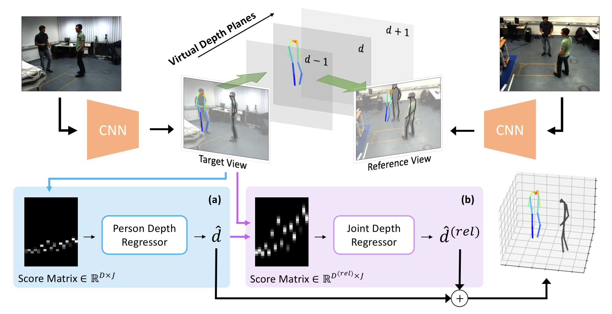

# Multi-View Multi-Person 3D Pose Estimation with Plane Sweep Stereo



This repository includes the source code for our CVPR 2021 paper on multi-view multi-person 3D pose estimation. Please read our paper for more details at [https://arxiv.org/abs/2104.02273](https://arxiv.org/abs/2104.02273). The project webpage is available [here](https://jiahaoLjh.github.io/PlaneSweepPose).

Bibtex:

```
@InProceedings{Lin_2021_CVPR,
    author    = {Lin, Jiahao and Lee, Gim Hee},
    title     = {Multi-View Multi-Person 3D Pose Estimation With Plane Sweep Stereo},
    booktitle = {Proceedings of the IEEE/CVF Conference on Computer Vision and Pattern Recognition (CVPR)},
    month     = {June},
    year      = {2021},
    pages     = {11886-11895}
}
```

### Environment

Our code is tested on

* Python 3.8.5
* PyTorch 1.6.0 & torchvision 0.7.0
* CUDA 11.2

### Preparing Data

Download following data before using the code in this repository:

* Annotations and 2D pose predictions for [the Campus and the Shelf](http://campar.in.tum.de/Chair/MultiHumanPose) datasets can be downloaded [here](https://drive.google.com/drive/folders/1rb2302rtWP77cP_lhcJowplAO3RSiNLr?usp=sharing). Credit to [VoxelPose](https://github.com/microsoft/voxelpose-pytorch).
* Follow the instructions on the [CMU Panoptic Github repo](https://github.com/CMU-Perceptual-Computing-Lab/panoptic-toolbox) to download the annotations. 2D pose predictions can be downloaded [here](https://drive.google.com/drive/folders/1lf8l1jYFeY_uekUgTGEUDVIJStPBZbEg?usp=sharing).
* Pre-trained models can be downloaded [here](https://drive.google.com/drive/folders/1igET5UFlTvJwbRqs9v_4981uObFZ4hjo?usp=sharing).

The data should be organized as follows:

```
    ROOTDIR/
        └── data/
            └── Campus/
                └── actorsGT.mat
                └── calibration_campus.json
                └── pred_campus_maskrcnn_hrnet_coco.pkl
            └── Shelf/
                └── actorsGT.mat
                └── calibration_shelf.json
                └── pred_shelf_maskrcnn_hrnet_coco.pkl
            └── Panoptic/
                └── 160224_haggling1/
                └── 160226_haggling1/
                └── ...
                └── keypoints_train_results.json
                └── keypoints_validation_results.json
            └── panoptic_training_pose.pkl
        └── output/
            └── campus_synthetic/mvmppe/config/model_best_pretrained.pth.tar
            └── shelf_synthetic/mvmppe/config/model_best_pretrained.pth.tar
            └── panoptic/mvmppe/config/model_best_pretrained.pth.tar
        └── ...
```

### Training and Inference

Below are the commands for training our model on different datasets.

__The Campus dataset:__

```
    python run/train.py --cfg configs/campus/config.yaml
```

__The Shelf dataset:__

```
    python run/train.py --cfg configs/shelf/config.yaml
```

__The CMU Panoptic dataset:__

```
    python run/train.py --cfg configs/panoptic/config.yaml
```

Below are the commands for performing inference with our pre-trained models.

__The Campus dataset:__

```
    python run/validate.py --cfg configs/campus/config.yaml -t pretrained
```

__The Shelf dataset:__

```
    python run/validate.py --cfg configs/shelf/config.yaml -t pretrained
```

__The CMU Panoptic dataset:__

```
    python run/validate.py --cfg configs/panoptic/config.yaml -t pretrained
```
